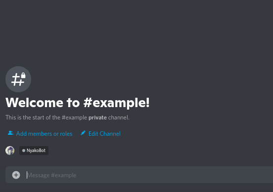

# Hello, Desuko!

Let's make a simple module for Desuko and walk you through it.

*tutorial.py*:
```python
__NAME__ = 'tutorial'
__DESC__ = '"Hello, World" module for Desuko'

class Module:
    def __init__(self, loader, slash_group, config):
        self.slash_group = slash_group
        loader.subscribe('desuko.bot.register_slash', self.register_slash)

    def register_slash(self):
        self.slash_group.command()(self.desuko)

    async def desuko(self, ctx):
        await ctx.respond('Hello, Desuko!')
```

*desuko.yaml*:
```yaml
modules:
  tutorial:
```

Let's explain what we did here step-by-step:

1. On the first lines we provide a name for a Discord slash group and a module description. Having these variables is **required**.
2. Next, we create a `Module` class. It represents our main entry.
3. Then we provide an `__init__()` function to set attributes and bind class functions with handlers.
4. `register_slash()` registers all our functions as Discord slash commands.
5. Finally, `desuko()` is an actual Discord command. Its corresponding name will be `/tutorial desuko` (`/<__NAME__> <func name>`).

To connect it with a Desuko bot, simply provide the module name in `desuko.yaml`.

!!! warning
    The names of the `Module` class, `__NAME__` and `__DESC__` should **not** change. Loader tries to find exactly these names.

**Result:**


